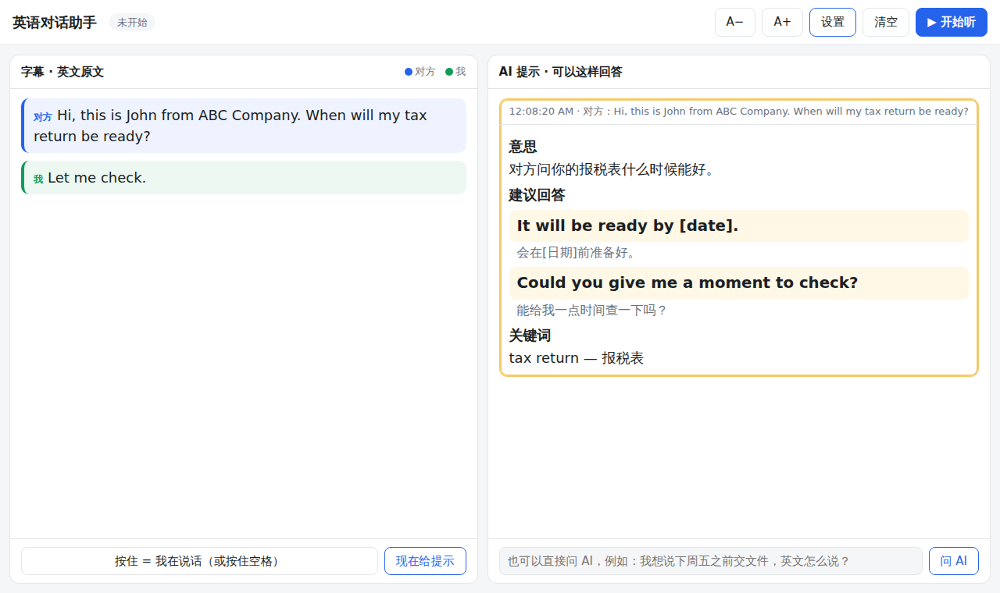

# 英语对话助手（AI-aid Listening and Answering）

英语不好也能打英文电话、和外国人当面交流：

- **左边：字幕**。把对方（和你自己）说的英文实时变成文字。
- **右边：AI 提示**。对方说完一句，AI 马上告诉你：
  - 【意思】对方在说什么（中文）
  - 【建议回答】两句简单的英文回答，每句都带中文意思
  - 【关键词】对方话里的关键单词

你看着提示，再用自己的话说出来就行。



## 一、安装（只需要做一次）

1. 安装 [Node.js](https://nodejs.org/) 22 或更新版本。
2. 下载本项目，在项目文件夹里打开终端，运行：
   ```bash
   npm install
   ```
3. 把 `.env.example` 复制一份，改名为 `.env`，填入 Key：
   - `ANTHROPIC_API_KEY`（必填）：在 <https://console.anthropic.com/> 申请，用来生成回答提示。
   - `DEEPGRAM_API_KEY`（可选）：在 <https://console.deepgram.com/> 申请。填了以后识别更准，而且能听电脑里的声音。

## 二、使用

```bash
npm start
```

然后用 **Chrome 或 Edge** 打开 <http://localhost:3000>，点右上角「设置」选好模式，再点「▶ 开始听」。

### 选哪种模式？

| 你的情况 | 语音识别 | 对方的声音从哪来 |
| --- | --- | --- |
| 手机打电话，开**免提外放**放在电脑旁边 | 浏览器自带 或 Deepgram | 麦克风 |
| 当面和人说话 | 浏览器自带 或 Deepgram | 麦克风 |
| 用电脑打电话（Zoom、Teams、Google Meet、WhatsApp 网页版、网络电话等） | **Deepgram** | 电脑声音 |

- **麦克风模式**：只有一个麦克风，程序分不清谁在说话。默认都算「对方」；**你自己说话时按住空格键**（或按住左下角的按钮），这样你的话会标成「我」，AI 能更好地理解上下文。
- **电脑声音模式**：点开始后，浏览器会弹出「选择要分享的内容」：
  - Windows：选「整个屏幕」，并勾选 **「同时分享系统音频」**。
  - Mac：Chrome 只能分享**某个标签页**的声音（选「Chrome 标签页」并勾选「分享标签页音频」），适合网页版会议。
  - 这时对方的声音走电脑声音，你的声音走麦克风，程序会自动分清「对方」和「我」。**建议戴耳机**，不然麦克风会把对方的声音也录进去。

### 其它功能

- **背景信息**：在设置里写上你是谁、这通电话大概是关于什么（可以写中文），AI 的建议会更贴切。
- **现在给提示**：自动提示没出来、或想让 AI 再想一次时点它。
- **问 AI**：右下角可以直接输入中文问题，比如「我想说下周五之前交文件，英文怎么说？」
- **A− / A+**：调整字体大小。
- 对方连续说话时，旧的提示会自动停止，换成根据最新内容的提示。

## 三、费用和隐私

- 浏览器自带识别是免费的（Chrome 会把声音发到 Google 的服务器识别）。
- Deepgram 按识别时长收费，新用户有免费额度。
- Claude 按用量收费；每条提示只发送最近 30 句对话和你的背景信息。
- 服务器默认只在你自己电脑上运行（只监听 `127.0.0.1`），API Key 保存在 `.env`，不会发到浏览器。

## 四、技术说明

```
浏览器 (public/)                      本机 Node 服务器 (server.js)
 ├─ 麦克风 / 电脑声音                   ├─ /ws/stt   → Deepgram 实时识别（转发音频）
 ├─ Web Speech API（浏览器自带识别）      └─ /api/hint → Claude（流式返回提示）
 ├─ 左：字幕    右：AI 提示卡片
```

- `src/hint.js`：给 Claude 的提示词和调用（默认模型 `claude-opus-5`，`effort: low` 以求最快出结果；开启了服务器端 `fallbacks: "default"`，万一请求被模型拒绝会自动换模型重试）。
- `src/deepgram.js`：Deepgram 实时识别的 WebSocket 转发。
- `public/pcm-worklet.js`：把音频转成 16kHz PCM 发给服务器。
- 可在 `.env` 用 `HINT_MODEL` / `HINT_EFFORT` 调整模型和思考深度。
